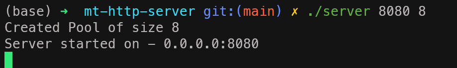
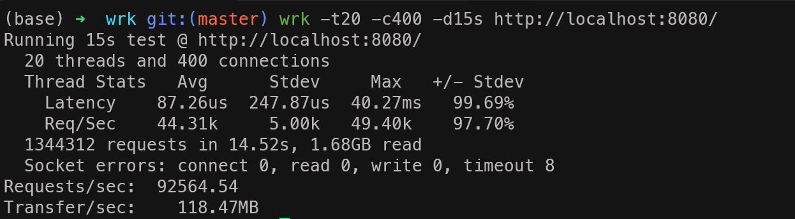

# Multi-Threaded HTTP Server in C++

A high-performance, multi-threaded HTTP server built from scratch using C++ and POSIX sockets.

This project implements a **Thread Pool** architecture to handle concurrent client connections efficiently. It avoids external networking libraries to demonstrate a deep understanding of low-level system calls, memory management, and synchronization primitives.

---

## Key Features

- **Custom Thread Pool:** Implements a fixed-size pool of worker threads to handle requests, reducing the overhead of creating/destroying threads for every connection.
- **Concurrency Control:** Uses `std::mutex` and `std::condition_variable` to safely manage the task queue and synchronize worker threads.
- **Backpressure Handling:** Automatically rejects new clients with `503 Service Unavailable` if the request queue is full, preventing server overload (DoS protection).
- **HTTP 1.1 Support:** Parses raw HTTP requests, handles headers, and maintains persistent connections (`keep-alive`).
- **Session Management:** Implements basic cookie-based authentication (Login/Logout flows) and secure route protection.
- **System Monitoring:** Reads directly from the Linux kernel (`/proc/loadavg`) to display real-time CPU load.

## Performance Benchmarks



**Command:** `wrk -t20 -c400 -d15s http://localhost:8080/`

| Metric             | Result                |
| :----------------- | :-------------------- |
| **Requests/sec**   | **92,564.54**         |
| **Total Requests** | 1,344,312 (in 14.52s) |
| **Transfer/sec**   | 118.47 MB             |
| **Avg Latency**    | 87.26 µs              |
| **Errors**         | 8 timeouts (0.0006%)  |

_Configuration: 8 Worker Threads, 1000 Queue Size, 400 Concurrent Connections._



---

## Tech Stack

- **Language:** C++ (Standard Library)
- **Networking:** POSIX Sockets (socket, bind, listen, accept)
- **Concurrency:** C++ Threads, Mutexes, Condition Variables
- **OS APIs:** Linux File System I/O, Signal Handling

---

## How to Run

Since this project uses standard C++ libraries and POSIX threads, no complex build system is required.

**1. Compile:**

Use `g++` to compile the source. The `-pthread` flag is essential for threading support.

```bash
g++ -pthread -std=c++17 main.cpp -o server -pthread
```

**2. Start the Server**

Run the binary. The server will listen on port **8080**. You can optionally specify the port and thread pool size.

```bash
./server [PORT] [Number of Threads]

# Example: Run on port 8080 with 8 worker threads
./server 8080 8
```

**3. Access**

Open your web browser and navigate to: `http://localhost:8080`

### API Endpoints

| Method | Endpoint   | Description                                      |
| ------ | ---------- | ------------------------------------------------ |
| GET    | /          | Serves the index.html file.                      |
| GET    | /cpu       | Returns real-time server CPU load from kernel.   |
| GET    | /info      | Returns a JSON response with server info.        |
| POST   | /login     | Simulates login and sets a session_token cookie. |
| GET    | /dashboard | Protected Route. Only accessible if logged in.   |
| GET    | /logout    | Clears the session cookie.                       |

---

## System Architecture

The server follows the Producer-Consumer pattern:

**1. Main Thread (Producer):** Listens on the specified port. When a connection is accepted, it pushes the client socket descriptor into a thread-safe `std::queue`.

**2. Worker Threads (Consumers):** A pool of threads waits for tasks. When a socket is available, a thread wakes up, locks the queue, retrieves the socket, and processes the HTTP request.

**3. Synchronization:** Access to the queue is protected by a mutex to prevent race conditions. A `condition_variable` is used to put threads to sleep when idle, saving CPU resources.

## License

This project is open-source and available for educational purposes.
